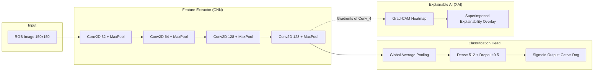
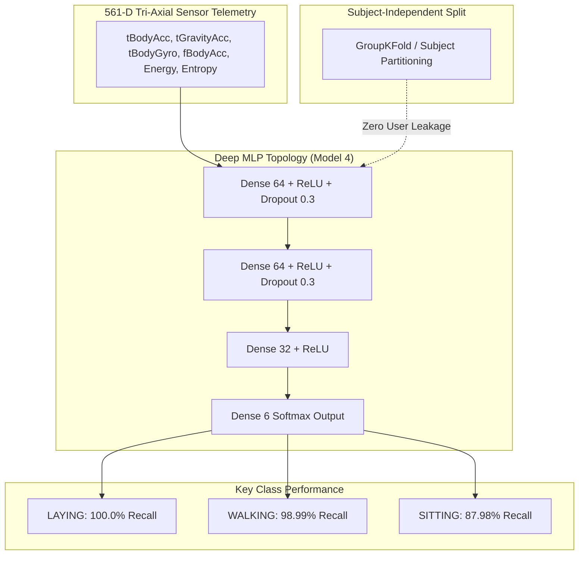
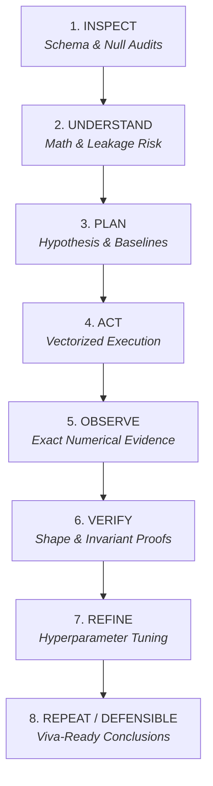

<div align="center">

# Data Science & Deep Learning Lab

**Production-grade machine learning pipelines, deep neural network architectures, and evidence-based AI research.**

[](https://github.com/shayanazmi/DataScience_practice)
[](https://github.com/shayanazmi/DataScience_practice/pulls)
[](LICENSE)
[](https://www.python.org/)
[](https://pytorch.org/)
[](https://tensorflow.org/)
[](https://scikit-learn.org/)
[](https://colab.research.google.com/github/shayanazmi/DataScience_practice)

[Explore Practicals](#-deep-learning-practicals-leaderboard) • [Industry Projects](#-industry-machine-learning-projects) • [Crown Jewels](#-featured-crown-jewels) • [Agent Skills](#-autonomous-ai-research-harness) • [Quickstart](#-reproduction--quickstart)

</div>

---

## ⚡ Repository at a Glance

```
├── 🧠 7 Deep Learning Practicals (Perceptrons, PyTorch FNN, Keras MLP, CNN + Grad-CAM XAI, HAR Sensors)
├── 📊 5 Industry ML Pipelines (Device-Segmented XGBoost, Predictive Maintenance, Churn, Insurance EDA)
├── 🔬 Autonomous Research Harness (.agents/skills closed-loop experimental engineering)
└── 🚀 1-Click Reproducible (Zero-setup Google Colab launchers for all notebooks)
```

---

## 💎 Featured Crown Jewels

### 1. Computer Vision & Explainable AI (Grad-CAM) — Practical 5
> **Binary Image Classification with Explainability Heatmaps** | **80.50% Test Accuracy** | **0.8843 ROC-AUC**

A Convolutional Neural Network with Global Average Pooling (GAP), dynamic Dropout, and visual interpretability using **Gradient-weighted Class Activation Mapping (Grad-CAM)** and layer-wise feature map extractions.



- **Highlights:** Perceptual image hashing (`imagehash`), batch normalization, data augmentation, visual verification of neural activation loci.
- **Deep Dive:** [`practical_5/practical_5_readme.md`](./practical_5/practical_5_readme.md) • [](https://colab.research.google.com/github/shayanazmi/DataScience_practice/blob/main/practical_5/cnn_implementation_keras.ipynb)

---

### 2. Smartphone Sensor Telemetry & HAR (MLP) — Practical 7
> **Human Activity Recognition from 561-feature Sensor Telemetry** | **95.05% Test Accuracy** | **0.9498 Macro F1**

Multi-layer Perceptron classifying 6 distinct human physical postures from accelerometer and gyroscope telemetry. Evaluated with strict **Subject-Independent Group Stratification** to prevent spatial-temporal data leakage across human participants.



- **Highlights:** Dynamic Learning Rate Annealing (`ReduceLROnPlateau`), Early Stopping checkpoint restoration, 3×3 optimizer hyperparameter grid sweep (Adam vs SGD Momentum).
- **Deep Dive:** [`practical_7/README.md`](./practical_7/README.md) • [](https://colab.research.google.com/github/shayanazmi/DataScience_practice/blob/main/practical_7/practical_7_keras_mlp_multiclass.ipynb)

---

### 3. Industrial End-to-End ML Pipelines
Real-world operational intelligence notebooks built with production-grade data pipelines:

| Project | Key Focus & Technical Novelty | Architecture / Stack | Launch |
| :--- | :--- | :--- | :---: |
| **Flight Propensity Modeling** | Device-segmented conversion prediction on imbalanced booking telemetry. | Segmented XGBoost, Scikit-Learn | [](https://colab.research.google.com/github/shayanazmi/DataScience_practice/blob/main/flight-ticket-propensity-device-segmented-xgboost.ipynb) |
| **Engine Health Diagnostics** | Multi-sensor predictive maintenance and remaining useful life (RUL) modeling. | Sensor Signal Regression, Scikit-Learn | [](https://colab.research.google.com/github/shayanazmi/DataScience_practice/blob/main/engine-health-prediction.ipynb) |
| **Supply Chain Analytics** | Multi-echelon inventory optimization, lead time risk scoring, and demand profiling. | Pandas, Seaborn, Optimization Analytics | [](https://colab.research.google.com/github/shayanazmi/DataScience_practice/blob/main/supply-chain.ipynb) |

---

## 🏆 Deep Learning Practicals Leaderboard

Comprehensive practicals covering fundamental perceptrons to advanced deep learning architectures:

| # | Practical | Description & Methodology | Architecture / Framework | Benchmark Metrics | Run |
| :-: | :--- | :--- | :--- | :--- | :-: |
| **P1** | [**Perceptron Simulation**](./practical_1/practical_1_readme.md) | Single-layer Perceptron built from scratch with NumPy learning logical AND gate decision boundaries. | NumPy, Python 3 | 100% Convergence (Loss $\to$ 0) | [](https://colab.research.google.com/github/shayanazmi/DataScience_practice/blob/main/practical_1/practical_1.ipynb) |
| **P2** | [**Single Neuron ANN**](./practical_2/practical_2_readme.md) | Feedforward ANN with 4 hidden neurons, ReLU activation, and Sigmoid output training binary logic gates. | Keras, TensorFlow | 100% Training Accuracy | [](https://colab.research.google.com/github/shayanazmi/DataScience_practice/blob/main/practical_2/practical_2.ipynb) |
| **P3** | [**PyTorch FNN**](./practical_3/practical_3_readme.md) | Modular PyTorch `nn.Module` Feedforward Neural Network using Adam optimizer and `BCELoss`. | PyTorch 2.x, Python 3 | 100% Binary Accuracy | [](https://colab.research.google.com/github/shayanazmi/DataScience_practice/blob/main/practical_3/practical_3.ipynb) |
| **P4** | [**Iris Multiclass MLP**](./practical_4/practical_4_readme.md) | Deep MLP ($4 \to 10 \to 8 \to 3$) for multi-class classification using Softmax and Categorical Cross-Entropy. | Keras, Scikit-Learn | 96.67% Test Accuracy | [](https://colab.research.google.com/github/shayanazmi/DataScience_practice/blob/main/practical_4/practical_4.ipynb) |
| **P5** | [**CNN & Grad-CAM XAI**](./practical_5/practical_5_readme.md) | 4-Stage Conv2D + GAP architecture on Cats vs Dogs with visual interpretability and activation maps. | Keras, TensorFlow, Grad-CAM | **80.50% Acc, 0.8843 ROC-AUC** | [](https://colab.research.google.com/github/shayanazmi/DataScience_practice/blob/main/practical_5/cnn_implementation_keras.ipynb) |
| **P6** | [**Grid Load Forecasting**](./practical_6/practical_6_readme.md) | Tapered regression MLP ($29 \to 64 \to 32 \to 16 \to 1$) predicting national grid load with multi-activation sweeps. | Keras, Scikit-Learn, Pandas | **9,990 MW MAE, 5.51% MAPE** | [](https://colab.research.google.com/github/shayanazmi/DataScience_practice/blob/main/practical_6/p6.ipynb) |
| **P7** | [**Smartphone HAR MLP**](./practical_7/README.md) | Deep sensory MLP on 561-D telemetry across 6 activities with Subject-Independent cross-validation. | Keras, TensorFlow, Seaborn | **95.05% Acc, 0.9498 Macro F1** | [](https://colab.research.google.com/github/shayanazmi/DataScience_practice/blob/main/practical_7/practical_7_keras_mlp_multiclass.ipynb) |

---

## 📊 Industry Machine Learning Projects

| Notebook | Domain | Key Machine Learning Techniques | Key Libraries | Run |
| :--- | :--- | :--- | :--- | :-: |
| [`customer-churn-prediction.ipynb`](./customer-churn-prediction.ipynb) | FinTech / SaaS | Class imbalance handling, Random Forests, Gradient Boosting, ROC curves | `scikit-learn`, `pandas`, `seaborn` | [](https://colab.research.google.com/github/shayanazmi/DataScience_practice/blob/main/customer-churn-prediction.ipynb) |
| [`customer-insurance-sales-eda-and-performance-model.ipynb`](./customer-insurance-sales-eda-and-performance-model.ipynb) | InsurTech | Statistical EDA, missing data imputation, conversion probability scoring | `pandas`, `matplotlib`, `scipy` | [](https://colab.research.google.com/github/shayanazmi/DataScience_practice/blob/main/customer-insurance-sales-eda-and-performance-model.ipynb) |
| [`engine-health-prediction.ipynb`](./engine-health-prediction.ipynb) | IoT / Manufacturing | Sensor time-series telemetry analysis, degradation threshold modeling | `scikit-learn`, `numpy` | [](https://colab.research.google.com/github/shayanazmi/DataScience_practice/blob/main/engine-health-prediction.ipynb) |
| [`flight-ticket-propensity-device-segmented-xgboost.ipynb`](./flight-ticket-propensity-device-segmented-xgboost.ipynb) | E-Commerce / Travel | Device-segmented feature engineering, hyperparameter tuning, XGBoost | `xgboost`, `scikit-learn`, `pandas` | [](https://colab.research.google.com/github/shayanazmi/DataScience_practice/blob/main/flight-ticket-propensity-device-segmented-xgboost.ipynb) |
| [`supply-chain.ipynb`](./supply-chain.ipynb) | Logistics & Ops | Lead-time variance estimation, stockout probability, distribution metrics | `pandas`, `matplotlib`, `seaborn` | [](https://colab.research.google.com/github/shayanazmi/DataScience_practice/blob/main/supply-chain.ipynb) |

---

## 🤖 Autonomous AI Research Harness

All laboratory practicals and machine learning pipelines in this repository adhere to custom agent engineering skills researched and authored to enforce **strict experimental rigor, zero data leakage, and viva-defensible results**:



- [`data-science-lab-harness`](./.agents/skills/data-science-lab-harness/): The 8-stage closed-loop execution protocol for evidence-grounded machine learning workflows.
- [`notebook-engineering-style`](./.agents/skills/notebook-engineering-style/): Engineering standards for PEP 8 compliance, deterministic seeding, and modular data science pipelines.
- [`evidence-based-observations`](./.agents/skills/evidence-based-observations/): Strict 3-part formula tying cell conclusions directly to exact numerical outputs and causal mechanisms (zero fluff, zero analogies).
- [`Master Skills Catalog`](./.agents/skills/README.md): Index of all custom agent skill packages.

---

## 🚀 Reproduction & Quickstart

### Option 1: 1-Click Interactive Cloud Execution
Click any **Open In Colab** badge next to the respective practical or project above to launch an interactive GPU/CPU environment instantly.

### Option 2: Local Reproduction
```bash
# 1. Clone the repository
git clone https://github.com/shayanazmi/DataScience_practice.git
cd DataScience_practice

# 2. Create and activate a clean Python environment
conda create -n ml-lab python=3.10 -y
conda activate ml-lab

# 3. Install dependencies
pip install -r practical_7/requirements.txt  # Or install core ML/DL packages:
pip install torch torchvision tensorflow scikit-learn xgboost pandas numpy matplotlib seaborn jupyterlab

# 4. Launch JupyterLab
jupyter lab
```

---

## ⭐ Show Your Support

If you find these notebooks, deep learning architectures, or custom AI agent skills helpful, please consider **starring the repository** to support open research!

<div align="center">

[](https://github.com/shayanazmi/DataScience_practice)

</div>

---

## 📌 Citation & Attribution

If you use these architectures, notebooks, or custom AI agent skills in your research, coursework, or projects, please provide credit:

```bibtex
@misc{azmi2026datascience,
  author = {Shayan Azmi},
  title = {Data Science & Deep Learning Lab: Production-Grade ML Pipelines & Architectures},
  year = {2026},
  publisher = {GitHub},
  journal = {GitHub repository},
  howpublished = {\url{https://github.com/shayanazmi/DataScience_practice}}
}
```

---

## 👤 Author & Connect

- **Author:** Shayan Azmi
- **GitHub:** [@shayanazmi](https://github.com/shayanazmi)
- **Repository:** [shayanazmi/DataScience_practice](https://github.com/shayanazmi/DataScience_practice)

---

<div align="center">

<sub>Crafted with experimental rigor, evidence-based engineering, and deep learning.</sub>

</div>
