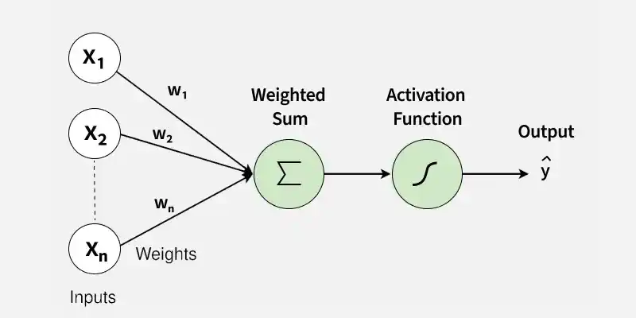

# Perceptron Simulation Using NumPy

A beginner-friendly implementation of a **Single-Layer Perceptron** using **Python** and **NumPy**. This notebook demonstrates the fundamental concepts of neural networks by training a perceptron to learn the behavior of a logical **AND gate**.

## Overview

The perceptron is one of the earliest and simplest artificial neural network models. It acts as a binary classifier that learns a decision boundary by adjusting its weights and bias based on training examples.

In this practical, we:

* Implement a perceptron from scratch using NumPy.
* Define a binary step activation function.
* Train the perceptron using the Perceptron Learning Rule.
* Test the model on logical AND gate inputs.
* Understand how weights and bias are updated during learning.

## Concepts Covered

* Artificial Neurons
* Perceptron Architecture
* Activation Functions
* Dot Product and Weighted Sum
* Binary Classification
* Supervised Learning
* Weight and Bias Updates
* Logical AND Gate Simulation

## Technologies Used

* Python 3
* NumPy

## Single Layer Perceptron Architecture



## Dataset

The perceptron is trained on the truth table of an AND gate:

| Input 1 | Input 2 | Output |
| ------- | ------- | ------ |
| 0       | 0       | 0      |
| 0       | 1       | 0      |
| 1       | 0       | 0      |
| 1       | 1       | 1      |

## How It Works

1. Initialize weights and bias to zero.
2. Calculate the weighted sum of inputs.
3. Apply the step activation function.
4. Compare prediction with the expected output.
5. Update weights and bias using the error.
6. Repeat the process for multiple epochs until learning converges.

## Learning Rule

The perceptron updates its parameters using:

```python
weights += learning_rate * error * input
bias += learning_rate * error
```

where:

* **error = target − prediction**
* **learning_rate** controls the size of updates

## Expected Outcome

After training, the perceptron correctly classifies all AND gate inputs and demonstrates how a simple neural network can learn linearly separable patterns.

## Educational Objective

This practical is designed to help students understand the mathematical and computational foundations of neural networks before moving on to more advanced deep learning architectures.

## Author

Created as part of ANN and Deep Learning Lab practical demonstrating the implementation of a Perceptron using NumPy.
