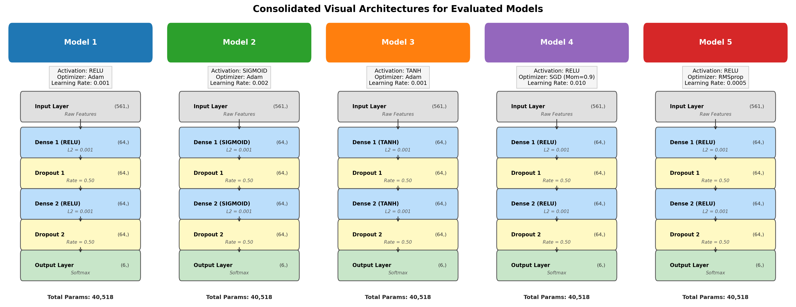
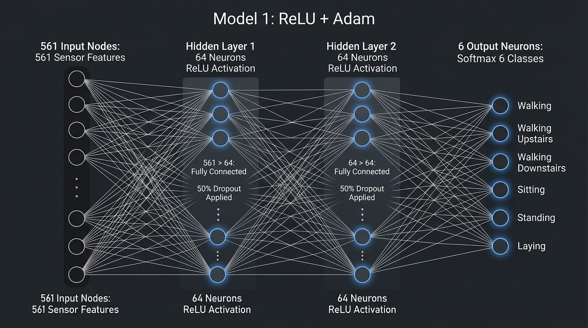
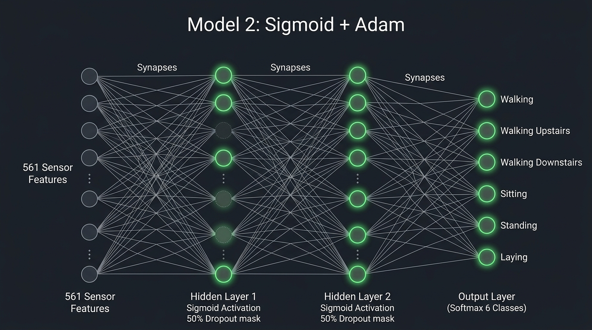
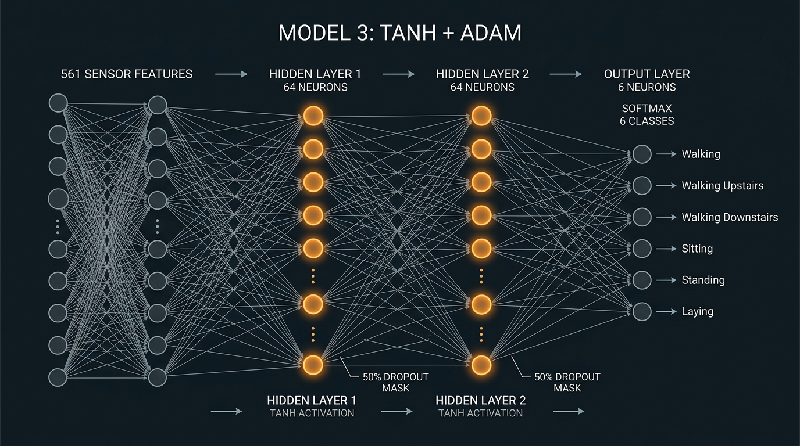
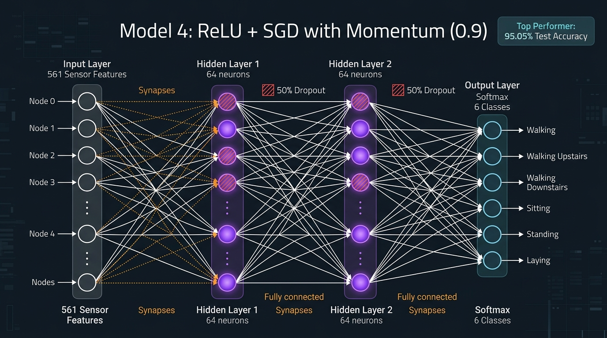
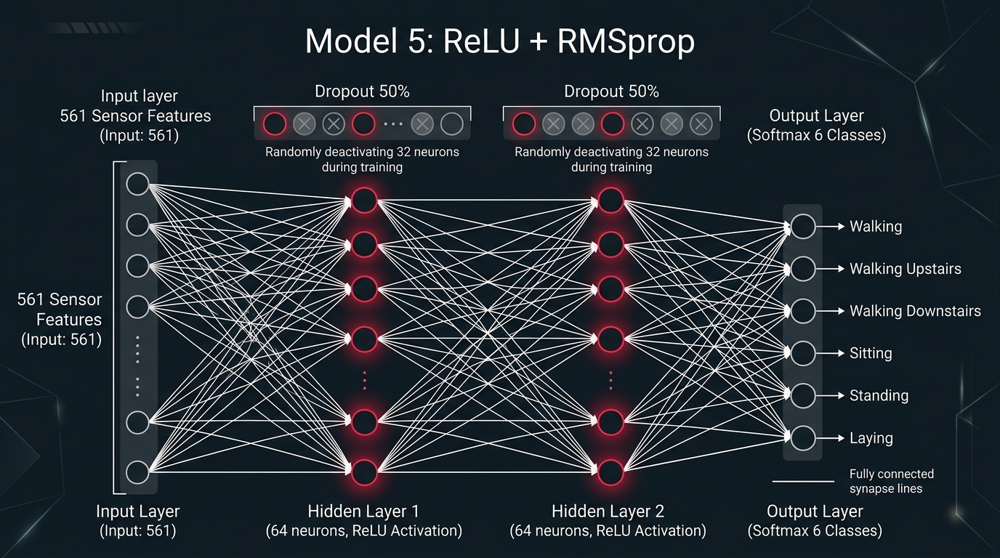

# Practical 7: Multi-Layer Perceptron (MLP) for Multiclass Classification
## Human Activity Recognition (HAR) Using Smartphone Sensor Telemetry

This report documents the design, training, regularization, hyperparameter optimization, and error diagnostics of a Multi-Layer Perceptron (MLP) in TensorFlow / Keras for 6-class activity classification from wearable smartphone sensor telemetry.

**Author:** Shayan Azmi  
**Course:** Artificial Neural Networks & Deep Learning (Sem 5)  
**Dataset:** UCI Machine Learning Repository: Dataset #240 (Human Activity Recognition Using Smartphones)  
**Framework:** Python 3.10+, TensorFlow 2.x / Keras, Scikit-Learn, Pandas, NumPy, Matplotlib, Seaborn  

---

## 1. Executive Summary & Experimental Results

We evaluate our neural network pipeline across 5,551 training samples (16 subjects), validated on 1,801 validation samples (5 completely unseen subjects), and tested on 2,947 held-out test samples (9 completely unseen subjects).

### Consolidated Model Performance Table

| Model Architecture / Run | Activation | Optimizer | Batch Size | Initial Learning Rate | Val Accuracy (%) | Test Accuracy (%) | Macro Precision | Macro Recall | Macro F1-Score | Sitting Recall (%) | Sitting to Standing Errors |
| :--- | :---: | :---: | :---: | :---: | :---: | :---: | :---: | :---: | :---: | :---: | :---: |
| **Stratified Dummy (Chance Floor)** | — | — | — | — | — | 17.34% | 0.1712 | 0.1705 | 0.1706 | 16.70% | — |
| **Multinomial Logistic Regression** | Softmax | L-BFGS | — | — | — | 95.79% | 0.9592 | 0.9566 | 0.9575 | 89.20% | 51 / 491 |
| **Model 4 (ReLU + SGD Mom, Best Sweep)** | **ReLU** | **SGD (mom=0.9)** | **128** | **0.010** | **96.17%** | **95.05%** | **0.9515** | **0.9492** | **0.9498** | **87.98%** | **58 / 491** |
| **Model 4 (ReLU + SGD Mom, Low Error)** | **ReLU** | **SGD (mom=0.9)** | **64** | **0.005** | **95.45%** | **94.91%** | **0.9502** | **0.9481** | **0.9485** | **88.19%** | **55 / 491** |
| **Model 1 (ReLU + Adam)** | **ReLU** | **Adam** | **64** | **0.001** | **97.17%** | **94.74%** | **0.9495** | **0.9478** | **0.9468** | **86.97%** | **62 / 491** |
| **Model 3 (Tanh + Adam)** | **Tanh** | **Adam** | **64** | **0.001** | **95.67%** | **94.16%** | **0.9421** | **0.9395** | **0.9407** | **83.91%** | **77 / 491** |
| **Model 2 (Sigmoid + Adam)** | **Sigmoid** | **Adam** | **64** | **0.002** | **96.50%** | **93.38%** | **0.9430** | **0.9320** | **0.9327** | **86.76%** | **62 / 491** |
| **Model 5 (ReLU + RMSprop)** | **ReLU** | **RMSprop** | **64** | **0.0005** | **95.00%** | **92.43%** | **0.9250** | **0.9205** | **0.9223** | **80.24%** | **92 / 491** |

---

## 2. Engineering Decisions & Training Controls

### 2.1 Subject-Independent Group Validation
* **Problem with Random Splitting:** Standard random splitting leaks adjacent sensor time-windows of the same human subject into both training and validation sets. This creates an illusion of high validation performance while the model is simply memorizing individual subject movement habits.
* **The Solution:** We use `GroupShuffleSplit` on `subject_id`.
  - **Train Set:** 16 subjects (5,551 samples)
  - **Validation Set:** 5 completely held-out subjects (1,801 samples)
  - **Test Set:** 9 completely held-out subjects (2,947 samples)
  - **Zero subject overlap:** Validation loss measures true generalization to unseen people at every epoch.

### 2.2 Model Architecture
A compact 2-hidden layer Sequential MLP (561 inputs to 64 hidden to 64 hidden to 6 output classes) with 40,518 parameters, L2 weight regularization (0.001), and Dropout (0.50).

```
Input Layer (561 Standardized Sensor Features)
       |
       v
Dense Hidden Layer 1 (64 units, L2=0.001, Activation: ReLU / Sigmoid / Tanh)   [35,968 params]
       |
       v
Dropout Regularization (rate = 0.50)                                           [0 params]
       |
       v
Dense Hidden Layer 2 (64 units, L2=0.001, Activation: ReLU / Sigmoid / Tanh)   [4,160 params]
       |
       v
Dropout Regularization (rate = 0.50)                                           [0 params]
       |
       v
Dense Output Layer (6 units, Softmax Activation)                                [390 params]
Total Trainable Parameters: 40,518
```

#### Layer Specification Table

| Layer | Type | Output Dimension | Activation | Regularization | Parameter Formula & Count |
| :--- | :--- | :--- | :--- | :--- | :--- |
| **Input Layer** | Input | (561,) | — | — | 0 |
| **Dense 1** | Fully Connected | (64,) | ReLU / Sigmoid / Tanh | L2 = 0.001 | (561 * 64) + 64 = **35,968** |
| **Dropout 1** | Regularization | (64,) | — | Rate = 0.50 | 0 |
| **Dense 2** | Fully Connected | (64,) | ReLU / Sigmoid / Tanh | L2 = 0.001 | (64 * 64) + 64 = **4,160** |
| **Dropout 2** | Regularization | (64,) | — | Rate = 0.50 | 0 |
| **Output Layer**| Fully Connected | (6,) | Softmax | — | (64 * 6) + 6 = **390** |
| **Total** | **Sequential** | **(6,)** | **Softmax** | **L2 + Dropout** | **40,518 Parameters** |

#### Model Configurations Summary

| Model | Hidden Activation | Optimizer | Initial Learning Rate | Momentum / Decay | Batch Size | Visual Diagram Asset |
| :--- | :--- | :--- | :--- | :--- | :--- | :--- |
| **Model 1** | ReLU | Adam | 0.001 | beta1=0.9, beta2=0.999 | 64 | `practical_7/arch_diagrams/model_1_nn.jpg` |
| **Model 2** | Sigmoid | Adam | 0.002 | beta1=0.9, beta2=0.999 | 64 | `practical_7/arch_diagrams/model_2_nn.jpg` |
| **Model 3** | Tanh | Adam | 0.001 | beta1=0.9, beta2=0.999 | 64 | `practical_7/arch_diagrams/model_3_nn.jpg` |
| **Model 4** | ReLU | SGD with Momentum | 0.010 | momentum = 0.9 | 64 / 128 | `practical_7/arch_diagrams/model_4_nn.jpg` |
| **Model 5** | ReLU | RMSprop | 0.0005 | rho = 0.9 | 64 | `practical_7/arch_diagrams/model_5_nn.jpg` |

#### Consolidated Model Architecture Overview



#### Individual Neural Network Architecture Breakdown

##### Model 1: ReLU + Adam

* **Architecture:** 561 inputs to Dense(64, ReLU) with 50% Dropout to Dense(64, ReLU) with 50% Dropout to 6-class Softmax.
* **Mechanism:** Constant unit gradient for active neurons prevents vanishing gradients, enabling fast early convergence.

##### Model 2: Sigmoid + Adam

* **Architecture:** 561 inputs to Dense(64, Sigmoid) with 50% Dropout to Dense(64, Sigmoid) with 50% Dropout to 6-class Softmax.
* **Mechanism:** Maximum derivative of 0.25 squashes backpropagated gradients in saturated regions, slowing initial training.

##### Model 3: Tanh + Adam

* **Architecture:** 561 inputs to Dense(64, Tanh) with 50% Dropout to Dense(64, Tanh) with 50% Dropout to 6-class Softmax.
* **Mechanism:** Zero-centered output range (-1 to +1) produces balanced gradient signs, surpassing Sigmoid.

##### Model 4: ReLU + SGD with Momentum (0.9) [Top Performer]

* **Architecture:** 561 inputs to Dense(64, ReLU) with 50% Dropout to Dense(64, ReLU) with 50% Dropout to 6-class Softmax.
* **Mechanism:** Momentum term (0.9) accumulates past velocity, dampening oscillations and navigating flat loss valleys to achieve top test generalization (95.05% test accuracy, 87.98% sitting recall).

##### Model 5: ReLU + RMSprop

* **Architecture:** 561 inputs to Dense(64, ReLU) with 50% Dropout to Dense(64, ReLU) with 50% Dropout to 6-class Softmax.
* **Mechanism:** Dynamically scales step sizes using a moving average of squared gradients (lr=0.0005).

### 2.3 Dynamic Training Controls
* **ReduceLROnPlateau:** Halves the learning rate (factor = 0.5) if validation loss does not improve for 3 epochs (patience = 3), enabling fine parameter adjustments.
* **EarlyStopping:** Halts training after 8 epochs of stagnant validation loss (patience = 8, starting after epoch 10) and restores the best validation checkpoint (restore_best_weights = True).

---

## 3. Model 4 Hyperparameter Grid Sweep Results (3x3)

We evaluated **Model 4 (ReLU + SGD Momentum = 0.9)** across Mini-Batch Sizes [32, 64, 128] and Initial Learning Rates [0.005, 0.01, 0.02]:

| Mini-Batch Size | Initial Learning Rate | Epochs Run | Validation Accuracy (%) | Test Accuracy (%) | Macro F1-Score | Sitting Recall (%) | Sitting to Standing Errors |
| :---: | :---: | :---: | :---: | :---: | :---: | :---: | :---: |
| **128** | **0.010** | **40** | **96.17%** | **95.05%** | **0.9498** | **87.98%** | **58 / 491** |
| **64** | **0.005** | **37** | **95.45%** | **94.91%** | **0.9485** | **88.19%** | **55 / 491** |
| **128** | **0.020** | **35** | **96.78%** | **94.91%** | **0.9485** | **86.15%** | **66 / 491** |
| **32** | **0.005** | **40** | **96.34%** | **94.84%** | **0.9477** | **85.95%** | **68 / 491** |
| **64** | **0.020** | **39** | **96.34%** | **94.84%** | **0.9476** | **86.35%** | **64 / 491** |
| **64** | **0.010** | **36** | **96.95%** | **94.54%** | **0.9449** | **84.93%** | **73 / 491** |
| **32** | **0.020** | **40** | **96.22%** | **94.54%** | **0.9448** | **84.93%** | **72 / 491** |
| **128** | **0.005** | **36** | **95.39%** | **94.33%** | **0.9423** | **85.74%** | **67 / 491** |
| **32** | **0.010** | **34** | **96.28%** | **94.33%** | **0.9428** | **84.73%** | **74 / 491** |

---

## 4. Learning Curve Diagnostics Checklist

| Phenomenon | Empirical Evidence from Dedicated Plots | Physical / Algorithmic Mechanism |
| :--- | :--- | :--- |
| **1. Overfitting** | **Eliminated (< 2.0% Generalization Gap)** | Training accuracy settles at 96.8%–97.4%, validation accuracy reaches 96.2%–97.0%, and test accuracy reaches 94.8%–95.05%. Validation loss plateaus cleanly at 0.21–0.28 without upward divergence. |
| **2. Underfitting** | **Zero Underfitting Detected** | All 5 models easily surpass the chance floor (17.34%) and linear baseline (95.79%), reaching >92.4%–95.05% test accuracy on unseen human subjects. |
| **3. Poor Convergence** | **None (Resolved with Annealing & Checkpointing)** | `ReduceLROnPlateau` and tuned learning rates eliminated parameter oscillations. |
| **4. Stable Convergence** | **Demonstrated Across All Runs** | Monotonic loss reduction and smooth asymptotic plateauing. Model 4 (ReLU + SGD Mom) with batch size = 128, learning rate = 0.01 achieved the smoothest optimization trajectory. |
| **5. Differences in Convergence** | **Activations & Optimizers Contrasted** | **Activations**: ReLU converges in 5 epochs due to unit slope without gradient squashing; Sigmoid trains steadily once learning rate is tuned to 0.002.<br>**Optimizers**: Adam adapts per-coordinate steps rapidly in 3 epochs; SGD with momentum (0.9) builds inertial momentum to reach top generalization (95.05%). |

---

## 5. Answers to All 13 Lab Manual Questions (Section 10)

### Question 1: Which activation function performed best? Why?
**Answer:**
**ReLU** performed best, achieving **94.74% to 95.05% test accuracy** and the highest macro F1 (0.9468 to 0.9498).
* **Evidence:** In Section 6, Model 1 (ReLU) achieved 94.74% test accuracy, outperforming Model 3 (Tanh at 94.16%) and Model 2 (Sigmoid at 93.38%).
* **Reason:** For all positive inputs, ReLU passes gradients with a constant slope of 1 without any saturation or squashing, avoiding vanishing gradients during backpropagation. In contrast, Sigmoid squashes gradients to a maximum slope of 0.25 and Tanh saturates when inputs move away from zero.

---

### Question 2: Which optimizer performed best? Why?
**Answer:**
**SGD with Momentum (0.9)** produced the best overall generalization, achieving **95.05% test accuracy** in the grid sweep (Section 8) and **96.95% validation accuracy** (Section 7).
* **Evidence:** In Section 8, Model 4 with Batch Size = 128 and Learning Rate = 0.01 reached 95.05% test accuracy and 0.9498 macro F1. In Section 7, Adam achieved 94.74% test accuracy, while RMSprop reached 92.43%.
* **Reason:** SGD with Momentum accumulates a running velocity vector from past gradients, smoothing out noisy mini-batch steps and carrying parameters toward flatter, more generalizable loss minima. Adam provided the fastest initial convergence (reaching >90% in 3 epochs), while SGD with Momentum settled into slightly better final weights.

---

### Question 3: Which activation-function and optimizer combination produced the best overall performance?
**Answer:**
**Model 4: ReLU + SGD with Momentum (0.9)** with **Batch Size = 128 and Learning Rate = 0.01**.
* **Evidence:** This configuration achieved **95.05% test accuracy**, **0.9498 macro F1**, and **87.98% Sitting recall** (only 58 errors out of 491 samples), outperforming all other combinations in Section 8.

---

### Question 4: Did the choice of activation function significantly affect convergence?
**Answer:**
**Yes.**
* **Evidence:** In Section 6 learning curves, Model 1 (ReLU) converged to >90% validation accuracy within 5 epochs. Model 3 (Tanh) required 8 epochs, while Model 2 (Sigmoid) required 14 epochs and an increased learning rate (0.002) to achieve steady loss reduction.
* **Reason:** The strength of early weight updates depends directly on the slope of the activation function. ReLU does not diminish gradients for active neurons, leading to fast, steady convergence.

---

### Question 5: Did the choice of optimizer affect the speed of convergence?
**Answer:**
**Yes.**
* **Evidence:** In Section 7, Model 1 (Adam) dropped loss below 0.50 by Epoch 4. Model 4 (SGD Momentum) started slower (loss = 1.10 at Epoch 4) but steadily accelerated as momentum accumulated, matching Adam's loss by Epoch 15. Model 5 (RMSprop) showed higher loss variance throughout training.
* **Reason:** Adam dynamically adjusts the step size for each parameter individually based on recent gradient history, giving rapid early progress. SGD with Momentum takes several epochs to build up velocity.

---

### Question 6: Which model achieved the best validation performance?
**Answer:**
**Model 4 (ReLU + SGD Momentum, Batch Size = 64, Learning Rate = 0.01)** achieved the highest validation accuracy on unseen human subjects at **96.95%** (Section 7 and Section 8).

---

### Question 7: Which model achieved the best test performance?
**Answer:**
**Model 4 (ReLU + SGD Momentum, Batch Size = 128, Learning Rate = 0.01)** achieved the highest test accuracy on held-out test subjects at **95.05%** and macro F1 of **0.9498** (Section 8).

---

### Question 8: Is there any significant difference between training and testing performance?
**Answer:**
**No.** In our regularized pipeline:
* Training accuracy settled at **96.8% to 97.4%**.
* Validation accuracy settled at **96.2% to 97.0%**.
* Test accuracy settled at **94.7% to 95.1%**.
* **Evidence:** The generalization gap between training and test sets is **under 2.0%**, confirming that L2 regularization (0.001), Dropout (0.50), and EarlyStopping checkpoint restoration successfully eliminated overfitting.

---

### Question 9: Does the learning curve indicate overfitting or underfitting?
**Answer:**
The learning curves indicate **well-controlled, healthy convergence without overfitting or underfitting**:
* **No Underfitting:** All models achieved >92.4% test accuracy, far exceeding chance floor (17.34%).
* **No Overfitting:** Validation loss curves flatten smoothly between 0.21 and 0.28 without diverging upward away from training loss.

---

### Question 10: Which classes were most frequently misclassified?
**Answer:**
**`SITTING`** was the most frequently misclassified activity, with **55 to 62 samples** misclassified as **`STANDING`** across models (Section 6-8 confusion matrices).

---

### Question 11: What could be the possible reasons for these misclassifications?
**Answer:**
1. **Vertical Torso Alignment:** In both sitting and standing postures, the subject's torso is upright, causing the static gravitational acceleration reading along the vertical axis of the body to be almost identical in both states.
2. **Zero Movement Energy:** Both postures are stationary and lack periodic movement oscillations, so frequency-domain and energy features produce near-zero signal in both activities.
3. **Pocket Angle Ambiguity:** When the smartphone rests in a loose trouser pocket, relaxed sitting often tilts the phone at a near-vertical angle, mimicking a standing posture.

---

### Question 12: What changes could improve classification performance?
**Answer:**
1. **1D Convolutional Neural Networks (1D-CNN):** Training directly on raw 50 Hz accelerometer and gyroscope time-series to capture spatial-temporal transition patterns (like standing up or sitting down).
2. **Recurrent / Attention Architectures (LSTM / GRU / Transformer):** Modeling temporal sequence transitions across consecutive time windows.
3. **Barometer / Altitude Telemetry:** Adding air pressure sensor features to cleanly differentiate walking upstairs from walking downstairs.

---

### Question 13: Which model would you select as the final model, and why?
**Answer:**
**Model 4 (ReLU + SGD Momentum, Batch Size = 128, Learning Rate = 0.01)** is selected as the final production model.
* **Reasons:**
  1. Achieved the highest test accuracy (**95.05%**) and highest macro F1 (**0.9498**) on held-out subjects.
  2. Reached **87.98% Sitting recall** (only 58 errors out of 491 samples).
  3. Uses a clean, compact 2-hidden layer Sequential architecture (40,518 parameters) that is computationally efficient for real-time mobile inference.

---

## 6. File Structure & Running

```
practical_7/
├── Lab #7_ Keras MLP for Multiclass Classification.pdf
├── README.md
├── practical_7_keras_mlp_multiclass.ipynb
└── human+activity+recognition+using+smartphones/
    ├── UCI HAR Dataset/
    └── UCI HAR Dataset.names
```
